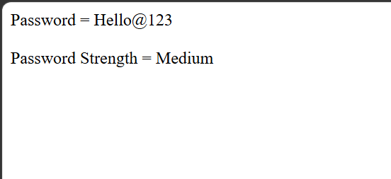

# Day 20 - JavaScript Password Strength Checker

## Overview

Created a simple Password Strength Checker using JavaScript to determine the strength of a password based on its length.

The task focused on using string length, conditional statements, and comparison operators to classify a password as Weak, Medium, or Strong.

## Topics Covered

- JavaScript Variables
- Strings
- String Length
- `.length` Property
- If-Else If-Else Conditions
- Comparison Operators
- Conditional Statements
- `document.write()`

## Technologies Used

- HTML5
- JavaScript

## Practice

Performed the following operations:

- Stored a password in a variable
- Checked the password length
- Classified the password based on its length
- Displayed the password
- Displayed the password strength

## Password Strength Criteria

- Less than 6 characters - Weak
- 6 to 9 characters - Medium
- 10 or more characters - Strong

## JavaScript Concepts Used

- `let`
- Variables
- Strings
- `.length`
- `if`
- `else if`
- `else`
- Comparison operators
- `document.write()`

## Output

## Learning Outcome

Learned how to work with strings and use the `.length` property with conditional statements to classify password strength based on its length.
