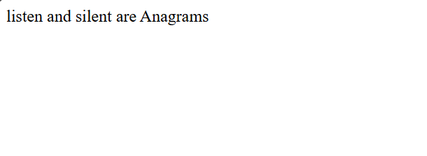

# Day 21 - JavaScript Anagram Checker

## Overview

Created a simple Anagram Checker using JavaScript to check whether two strings contain the same characters in a different order.

The task focused on using string methods to split, sort, and join the characters of two strings and then compare the results.

## Topics Covered

- JavaScript Variables
- Strings
- String Methods
- `split()`
- `sort()`
- `join()`
- String Comparison
- If-Else Condition
- Conditional Statements
- `document.write()`

## Technologies Used

- HTML5
- JavaScript

## Practice

Performed the following operations:

- Stored two strings in variables
- Converted each string into an array of characters
- Sorted the characters alphabetically
- Joined the sorted characters back into strings
- Compared the sorted strings
- Displayed whether the two strings are Anagrams

## JavaScript Concepts Used

- `let`
- Strings
- `.split()`
- `.sort()`
- `.join()`
- `if`
- `else`
- Comparison operator
- `document.write()`

## Output

## Learning Outcome

Learned how to use JavaScript string and array methods to compare two strings and determine whether they are Anagrams.
