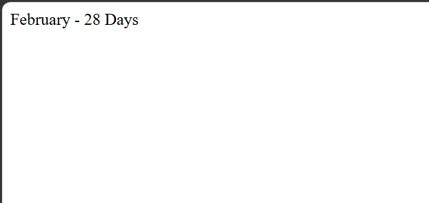

# Day 22 - JavaScript Month and Number of Days

## Overview

Created a simple JavaScript program to find the number of days in a month based on the given month number.

The task focused on using `if`, `else if`, and `else` conditions to match a month number with its corresponding month and number of days.

## Topics Covered

- JavaScript Variables
- Conditional Statements
- `if` Statement
- `else if` Statement
- `else` Statement
- Comparison Operators
- Month Numbers
- Number of Days
- Input Validation
- `document.write()`

## Technologies Used

- HTML5
- JavaScript

## Practice

Performed the following operations:

- Stored a month number in a variable
- Checked the month number using conditional statements
- Displayed the corresponding month name
- Displayed the number of days in the month
- Handled invalid month numbers

## JavaScript Concepts Used

- `let`
- Variables
- `if`
- `else if`
- `else`
- `==` operator
- Conditional statements
- `document.write()`

## Output

## Learning Outcome

Learned how to use multiple conditional statements to identify a month and display the corresponding number of days, while also handling invalid month values.
